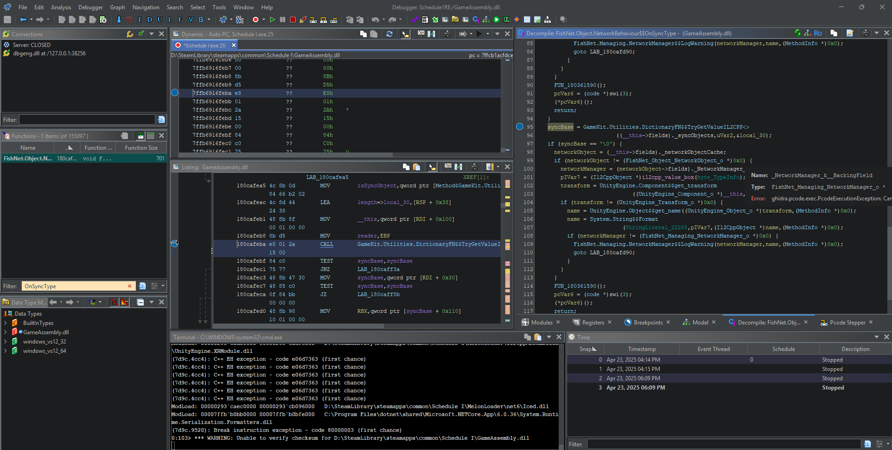
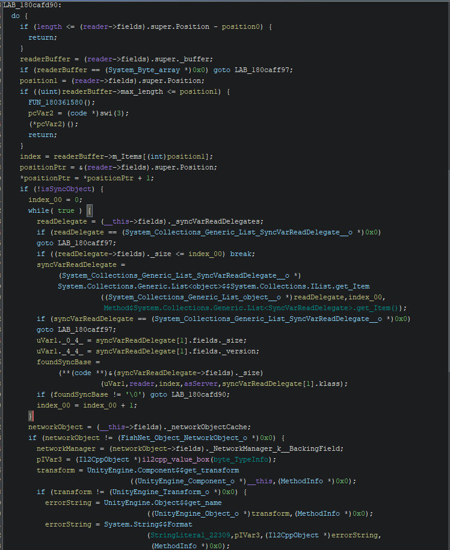

On the Mono branch you can attach Visual Studio to the running game and debug managed code directly. On
IL2CPP you cannot - the game is native machine code with none of the metadata C# carries. The one thing
IL2CPP does keep is a metadata file, and by feeding that into Ghidra you can recover legible type and
function information and set up a real native debugger. This is how you chase down hard crashes and
unexpected behaviour when the stack trace alone is not enough.

> Source: **XmusJackson (cheger32)** - [original message](https://discord.com/channels/1349221936470687764/1364718017090556045/1364718017090556045)

## Tools you need

Download and install all of these before starting:

- [Ghidra 11.3.2](https://github.com/NationalSecurityAgency/ghidra/releases/download/Ghidra_11.3.2_build/ghidra_11.3.2_PUBLIC_20250415.zip)
- [Il2CppDumper 6.7.46](https://github.com/Perfare/Il2CppDumper/releases/download/v6.7.46/Il2CppDumper-net6-win-v6.7.46.zip)
- WinDbg - install the [WDK](https://go.microsoft.com/fwlink/?linkid=2307500) if you do not have it. Do
  **not** use the UWP / Microsoft Store version; it breaks Ghidra's `dbgghidra` python module.
- Python 3 (3.12 or later)
- The **main** (IL2CPP) build of the game

## Step 1 - Dump the metadata

Run `Il2CppDumper.exe`. It asks for your game executable first (at the root of the game folder), then the
metadata file at:

```text
Schedule I\Schedule I_Data\il2cpp_data\Metadata\global-metadata.dat
```

Then, in the Il2CppDumper folder, run `il2cpp_header_to_ghidra.py` with Python 3. This produces
`il2cpp_ghidra.h`, which you import into Ghidra later.

## Step 2 - Patch Ghidra's exception handling

Open `Ghidra\Debug\Debugger-agent-dbgeng\pypkg\src\ghidradbg\hooks.py` and change line 480 from:

```python
return DbgEng.DEBUG_STATUS_BREAK
```

to:

```python
return DbgEng.DEBUG_STATUS_NO_CHANGE
```

:::caution
Without this change the debugger breaks on **every** first-chance exception, and the game throws thousands
of them during startup - you would be clicking Continue for ten minutes just to reach the menu. This step
may become unnecessary in a future Ghidra release.
:::

## Step 3 - Import GameAssembly.dll

1. Start Ghidra with `ghidraRun.bat` and create a new non-shared project (`File > New Project...`).
2. `File > Import File` and bring in `GameAssembly.dll`.
3. Right-click it in the list, `Open with > Debugger`, and click through the popups with default settings.
4. When Ghidra offers to analyze `GameAssembly.dll`, click **No** for now - the Il2CppDumper data will make
   the later analysis far more useful.

## Step 4 - Import the types

1. `File > Parse C Source...` and select the `il2cpp_ghidra.h` from step 1. Wait for any background task in
   the bottom-left corner to finish.
2. Open the script manager (the green Play icon). Click the "List" icon to manage script directories, add
   the Il2CppDumper folder, and close.
3. Find `ghidra_with_struct.py` and run it; it prompts for `script.json` in the Il2CppDumper folder. Let it
   finish.
4. `Analysis > Auto Analyze 'GameAssembly.dll'...`, keep the defaults, and click Analyze. This can take more
   than an hour, so grab a coffee.

## Step 5 - Configure the debugger

1. In the right-hand pane, open the `Modules` tab, click the gear icon, and choose **Auto-Map by Module** so
   `GameAssembly.dll` is recognised correctly.
2. `Debugger > Configure and launch GameAssembly.dll using... > dbgeng`. In the popup:
   - Point the first box at your Python executable or launcher (for example `C:\Windows\py.exe`).
   - Change the second box to target `Schedule I.exe` instead of `GameAssembly.dll`.
   - Deselect `dbgmodel`.
   - Point the last box at your WinDbg install (for example
     `C:\Program Files (x86)\Windows Kits\10\Debuggers\x64`).
3. Click **Launch**. The program should start and break at the entry point. To relaunch later with the same
   settings, just click the bug icon in the toolbar.

Once everything is wired up, the debugger looks like this - the `Dynamic` and `Listing` views on the left,
the `Decompile` view on the right, and the debugger terminal along the bottom:



## Step 6 - Set breakpoints and read the decompiler

Find a function through `Window > Functions` and type its name into the filter. Double-click it to show it in
the `Listing` view, then open the `Decompiler` view. Right-click an element and `Toggle Breakpoint` to break
there, then continue execution until you hit it.

Keep the `Listing` and `Dynamic` views synced: clicking an address in one should move the selection in the
other. The two addresses should **not** be identical, though - if they are, the module did not map
correctly. Check the modules list to confirm `GameAssembly.dll` is mapped to the open file; you may need to
let execution run until the game actually uses `GameAssembly.dll` before it syncs up.

As you rename and retype variables in the decompiler, the pseudocode becomes genuinely readable - here is a
FishNet read routine after some cleanup:



Matching that pseudocode against your own code is how you confirm native method signatures and vtable slot
indices for [advanced patching](/il2cpp/patching/#overriding-native-virtual-methods).

:::note
There is currently no universal way to set conditional breakpoints from the Ghidra UI - you would drive
those through `dbgeng` or the underlying Python shell in the terminal window that opens when debugging
starts.
:::

> Source: **XmusJackson (cheger32)** - [original message](https://discord.com/channels/1349221936470687764/1364718017090556045/1364718146618916976)
> Source: **XmusJackson (cheger32)** - [original message](https://discord.com/channels/1349221936470687764/1364718017090556045/1364718233881677845)
> Source: **XmusJackson (cheger32)** - [original message](https://discord.com/channels/1349221936470687764/1364718017090556045/1364718348071604324)
> Source: **XmusJackson (cheger32)** - [original message](https://discord.com/channels/1349221936470687764/1364718017090556045/1364722727646396488)
